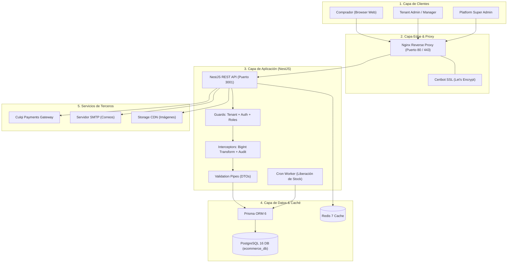

# 🌐 Documentación Global y Absoluta del Sistema
## Cleo Platform — SaaS E-Commerce Multi-Tenant de Nueva Generación

> **Documento Maestro Integral de Ingeniería:** Compendio absoluto de la arquitectura, topología, seguridad, ciclo de vida de datos y el **stack tecnológico completo** implementado en el ecosistema **Cleo Platform**.

---

## 📑 Tabla de Contenidos
1. [Ficha Técnica del Proyecto](#1-ficha-técnica-del-proyecto)
2. [Stack Tecnológico Integral por Capas](#2-stack-tecnológico-integral-por-capas)
   - [2.1 Capa Frontend (Client-Side)](#21-capa-frontend-client-side)
   - [2.2 Capa Backend (Server-Side & REST API)](#22-capa-backend-server-side--rest-api)
   - [2.3 Capa de Base de Datos y Persistencia](#23-capa-de-base-de-datos-y-persistencia)
   - [2.4 Capa de Infraestructura, DevOps y Redes](#24-capa-de-infraestructura-devops-y-redes)
   - [2.5 Servicios Externos e Integraciones](#25-servicios-externos-e-integraciones)
   - [2.6 Testing, Calidad y Automatización](#26-testing-calidad-y-automatización)
3. [Topología de Arquitectura del Ecosistema](#3-topología-de-arquitectura-del-ecosistema)
4. [Estructura del Monorepo y Convenciones de Código](#4-estructura-del-monorepo-y-convenciones-de-código)
5. [Políticas de Seguridad, Criptografía y Hardening OWASP](#5-políticas-de-seguridad-criptografía-y-hardening-owasp)
6. [Estrategia Multi-Tenant y Manejo de Transacciones ACID](#6-estrategia-multi-tenant-y-manejo-de-transacciones-acid)
7. [Manual de Comandos y Operaciones de Despliegue](#7-manual-de-comandos-y-operaciones-de-despliegue)

---

## 1. Ficha Técnica del Proyecto

| Parámetro | Detalle |
| :--- | :--- |
| **Nombre del Sistema** | **Cleo Platform** |
| **Modelo de Negocio** | SaaS B2B Multi-Tenant para Comercio Electrónico B2C / D2C |
| **Arquitectura de Software** | Monorepo Modular desacoplado (API First + SPA reactiva) |
| **Estrategia Multi-Tenant** | Base de datos compartida con aislamiento lógico por discriminador (`tenant_id`) e inyección automática en el ORM |
| **Capacidad de Concurrencia** | Stateless API escalable horizontalmente con balanceo por Nginx y caché en Redis |
| **Estado Actual del Software** | **Release Candidate (v1.0.0)** — Totalmente operativo en desarrollo y listo para producción |

---

## 2. Stack Tecnológico Integral por Capas

A continuación se detalla cada tecnología, biblioteca, framework y herramienta implementada en el sistema, junto con su versión y justificación técnica:

```
┌──────────────────────────────────────────────────────────────────────────────────────────┐
│                                       FRONTEND SPA                                       │
│    React 19 │ TypeScript 5.7 │ Vite 6 │ Tailwind CSS 3.4 │ TanStack Query 5 │ Zod 3.24   │
│             Radix UI Primitives │ Lucide React │ React Router 7 │ Remotion               │
└────────────────────────────────────────────┬─────────────────────────────────────────────┘
                                             │ HTTP/2 REST API + JWT Bearer
                                             ▼
┌──────────────────────────────────────────────────────────────────────────────────────────┐
│                                       BACKEND API                                        │
│     NestJS 10 │ Node.js 22 LTS │ TypeScript 5.7 │ Prisma ORM 6 │ RxJS 7 │ Helmet 8       │
│         Passport JWT │ BcryptJS │ Class-Validator │ Throttler 6 │ Nodemailer 9           │
└────────────────────────────────────┬─────────────────┬───────────────────────────────────┘
                                     │                 │
                Prisma Client (TCP)  │                 │  ioredis (TCP:6379)
                                     ▼                 ▼
┌──────────────────────────────────────────────┐ ┌─────────────────────────────────────────┐
│              POSTGRESQL 16+                  │ │                 REDIS 7                 │
│  PostgreSQL 16 Alpine (37 Tablas Relacionales│ │  Caché de sesiones, Rate Limiting,     │
│  Timestamptz, Índices Compuestos, JSONB)     │ │  Locks de concurrencia y Colas          │
└──────────────────────────────────────────────┘ └─────────────────────────────────────────┘
```

---

### 2.1 Capa Frontend (Client-Side)

El frontend está desarrollado como una Single Page Application (SPA) ultra rápida, moderna y de alto impacto visual orientada al usuario final y administradores:

| Tecnología / Biblioteca | Versión | Propósito y Justificación Técnica |
| :--- | :---: | :--- |
| **React** | `^19.0.0` | Biblioteca central de renderizado declarativo en base a componentes y hooks modernos. |
| **TypeScript** | `~5.7.2` | Tipado estático estricto que garantiza la seguridad en tiempo de compilación y previene errores de tipo en tiempo de ejecución. |
| **Vite** | `^6.1.0` | Bundler y servidor de desarrollo de última generación con compilación nativa basada en ES Modules y Hot Module Replacement (HMR) instantáneo. |
| **Tailwind CSS** | `^3.4.17` | Framework de diseño utilitario para la creación de interfaces responsivas, paletas HSL dinámicas y efectos *glassmorphism*. |
| **React Router DOM** | `^7.1.5` | Enrutamiento del lado del cliente con soporte de rutas dinámicas (`/productos/:slug`), layouts anidados y guardianes de ruta protegida. |
| **TanStack React Query** | `^5.66.0` | Gestión de estado asíncrono, almacenamiento en caché de peticiones de red, revalidación en segundo plano y mutaciones optimistas. |
| **React Hook Form** | `^7.54.2` | Manejo de formularios de alto rendimiento sin re-renderizados innecesarios del DOM. |
| **Zod** | `^3.24.1` | Validación de esquemas de datos y contratos en formularios (Checkout, Registro, Cupones) sincronizada con TypeScript. |
| **Radix UI Primitives** | `^1.x` | Componentes accesibles sin estilos (Dialog, Tooltip, Switch, Navigation Menu, Slot) que garantizan el cumplimiento de estándares WAI-ARIA. |
| **Lucide React** | `^0.475.0` | Iconografía vectorial moderna, limpia y personalizable en tamaño y color. |
| **Class Variance Authority (CVA)** | `^0.7.1` | Creación de variantes de diseño de componentes reutilizables con combinaciones de clases. |
| **Tailwind Merge & Clsx** | `^3.0.1` | Fusión inteligente de clases CSS sin conflictos de especificidad. |
| **Remotion & @remotion/player** | `^4.0.520` | Motor de renderizado y visualización de animaciones y contenido dinámico de alta fidelidad. |
| **PostCSS & Autoprefixer** | `^8.5.1` | Procesamiento y prefijado automático de reglas CSS para compatibilidad entre navegadores modernos. |

---

### 2.2 Capa Backend (Server-Side & REST API)

El backend está construido con un enfoque modular y arquitectura empresarial robusta:

| Tecnología / Biblioteca | Versión | Propósito y Justificación Técnica |
| :--- | :---: | :--- |
| **NestJS** | `^10.4.15` | Framework progresivo de Node.js basado en TypeScript con inyección de dependencias, controladores, servicios y módulos testeables. |
| **Node.js** | `v22.x LTS` | Entorno de ejecución JavaScript del lado del servidor de alto rendimiento con motor V8. |
| **Prisma ORM** | `^6.3.1` | ORM de nueva generación con tipado seguro en queries, migraciones declarativas y generación automática de cliente TS. |
| **Passport & Passport-JWT** | `^0.7.0` | Estrategia de autenticación estándar basada en la verificación de tokens JWT en cabeceras de autorización. |
| **@nestjs/jwt** | `^10.2.0` | Generación, firma criptográfica (HMAC-SHA256) y validación de tokens de sesión con expiración configurable. |
| **BcryptJS** | `^2.4.3` | Algoritmo de derivación de claves y hashing unidireccional de contraseñas con salting (10 rondas). |
| **Helmet** | `^8.3.0` | Middleware de seguridad que configura cabeceras HTTP defensivas (X-Content-Type-Options, Strict-Transport-Security, X-Frame-Options). |
| **@nestjs/throttler** | `^6.5.0` | Rate limiting para mitigar ataques de denegación de servicio (DoS) y fuerza bruta en endpoints sensibles de autenticación. |
| **Swagger / OpenAPI** | `^8.1.0` | Generador automático de documentación viva e interactiva de los contratos REST expuestos en `/api/docs`. |
| **Class-Validator & Transformer** | `^0.14.1` | Validación declarativa de DTOs con decoradores (`@IsString`, `@IsEmail`, `@Min`, `@IsOptional`) y transformación de tipos. |
| **Nodemailer** | `^9.1.1` | Motor de transporte y despacho de correos electrónicos transaccionales mediante SMTP con plantillas HTML responsivas. |
| **@nestjs/schedule** | `^12.0.1` | Programador de tareas cron en segundo plano para liberación automática de stock y mantenimiento periódico. |
| **ioredis** | `^6.0.0` | Cliente Redis ultra veloz con soporte de reconexión automática y operaciones en memoria. |
| **RxJS** | `^7.8.1` | Programación reactiva mediante observables utilizada internamente por el ciclo de interceptores de NestJS. |

---

### 2.3 Capa de Base de Datos y Persistencia

| Tecnología | Versión / Tipo | Propósito y Justificación Técnica |
| :--- | :---: | :--- |
| **PostgreSQL** | `16-alpine` | Motor relacional SQL principal. Soporta transacciones ACID estrictas, índices B-Tree/GIN, tipos `Timestamptz`, campos semiestructurados `JSONB` y claves foráneas en cascada. |
| **Redis** | `7-alpine` | Almacén de estructura de datos en memoria clave-valor para caché L1, control de concurrencia y sesiones volátiles. |
| **AsyncLocalStorage** | Nativo Node.js | Contexto asíncrono para propagar el `tenantId` en la cadena de llamadas de la API sin acoplamiento de parámetros. |

---

### 2.4 Capa de Infraestructura, DevOps y Redes

| Tecnología | Propósito y Configuración |
| :--- | :--- |
| **Docker** | Contenedorización de servicios garantizando paridad exacta entre entornos de desarrollo, staging y producción. |
| **Docker Compose** | Orquestador multi-contenedor que levanta en un solo comando la pila completa: API NestJS + PostgreSQL + Redis + Nginx + Certbot. |
| **Nginx (Alpine)** | Servidor web y Reverse Proxy de alto rendimiento que maneja la terminación SSL/TLS, compresión Gzip, balanceo de carga y reenvío de tráfico al puerto 3000/3001. |
| **Certbot (Let's Encrypt)** | Emisión y renovación automatizada de certificados SSL gratuitos para HTTPS seguro en producción. |
| **Redes Bridge (`cleo-network`)** | Red interna privada de Docker que aísla la base de datos PostgreSQL y Redis de la red pública, exponiendo únicamente el proxy Nginx. |

---

### 2.5 Servicios Externos e Integraciones

| Servicio | Protocolo / SDK | Función en Cleo Platform |
| :--- | :---: | :--- |
| **Culqi API** | REST HTTPS / JSON | Pasarela de pagos peruana líder. Tokenización de tarjetas de crédito/débito, cobros directos y procesamiento de webhooks con firma HMAC. |
| **Supabase Storage** | REST / S3 Compatible | Almacenamiento distribuido en la nube (CDN) para fotografías de catálogo y recursos de marca de los tenants. |
| **SMTP Providers** | SMTP Seguro (TLS) | Proveedores de correo saliente (Amazon SES, SendGrid o Gmail) para notificaciones de bienvenida, pagos y despacho. |

---

### 2.6 Testing, Calidad y Automatización

| Tecnología | Propósito |
| :--- | :--- |
| **Jest & ts-jest** | Framework de pruebas unitarias y de integración para servicios críticos (`OrdersService`, `AuthService`, `PaymentsService`). |
| **Selenium WebDriver (Python)** | Suite de pruebas automatizadas End-to-End (E2E) simulando navegación humana, compras reales y validación visual de interfaces. |
| **ESLint & Prettier** | Linter y formateador de código estandarizado para mantener consistencia sintáctica y buenas prácticas en el Monorepo. |

---

## 3. Topología de Arquitectura del Ecosistema



---

## 4. Estructura del Monorepo y Convenciones de Código

El repositorio está organizado como un **Monorepo Limpio** con separación de responsabilidades:

```
E-Commerce/
├── apps/
│   ├── api/                          # Backend NestJS 10 REST API
│   │   ├── prisma/
│   │   │   ├── schema.prisma         # Modelo de datos canónico (37 tablas)
│   │   │   └── seed.ts               # Semilla de datos iniciales de prueba
│   │   ├── src/
│   │   │   ├── auth/                 # Controladores y servicios de autenticación JWT
│   │   │   ├── catalog/              # Catálogo, productos, variantes y opciones
│   │   │   ├── inventory/            # Inventario, balance de stock y kardex
│   │   │   ├── orders/               # Motor de pedidos y snapshots
│   │   │   ├── payments/             # Integración con Culqi y webhooks
│   │   │   ├── shipping/             # Zonas de envío, tarifas y couriers
│   │   │   ├── coupons/              # Lógica de cupones y promociones
│   │   │   ├── platform/             # Administración global multi-tenant
│   │   │   ├── notifications/        # Plantillas y envío de correos
│   │   │   ├── common/               # Guards, Interceptors, Filters y Decoradores
│   │   │   └── database/             # PrismaService y extensiones
│   │   ├── Dockerfile                # Imagen Docker de producción
│   │   └── docker-compose.yml        # Configuración multi-contenedor
│   │
│   └── web/                          # Frontend React 19 SPA (Vite + Tailwind)
│       ├── public/                   # Recursos estáticos e imágenes de marca
│       ├── src/
│       │   ├── components/           # Componentes UI reutilizables y modales
│       │   ├── features/
│       │   │   ├── storefront/       # Vistas públicas (Home, Catálogo, Producto, Checkout)
│       │   │   ├── tenant-admin/     # Panel de Tienda (/admin)
│       │   │   ├── platform-admin/   # Panel Super Admin (/platform)
│       │   │   └── auth/             # Login, Registro, Recuperación
│       │   ├── hooks/                # Custom hooks (useAuth, useCart, useToast)
│       │   ├── layouts/              # StorefrontLayout, TenantAdminLayout, PlatformLayout
│       │   ├── routes/               # Enrutamiento central y ProtectedRoute
│       │   ├── services/             # Cliente HTTP apiRequest
│       │   └── types/                # Interfaces y contratos TypeScript
│
├── docs/                             # Documentación técnica de arquitectura
├── tests/                            # Pruebas automatizadas E2E en Selenium
├── package.json                      # Scripts de orquestación unificados
└── README.md                         # Documento de bienvenida y setup rápido
```

---

## 5. Políticas de Seguridad, Criptografía y Hardening OWASP

| Vector de Amenaza (OWASP) | Mecanismo de Mitigación Implementado en Cleo Platform |
| :--- | :--- |
| **A01: Broken Access Control** | • Aislamiento lógico multi-tenant inyectado en consultas de base de datos.<br>• Triple capa de control: `TenantGuard` + `JwtAuthGuard` + `RolesGuard`.<br>• Validación de propiedad: un usuario solo puede acceder a sus propias órdenes y direcciones. |
| **A02: Cryptographic Failures** | • Hashing de contraseñas mediante `bcryptjs` con factor de coste de 10 rondas.<br>• Tokens JWT firmados con algoritmo HMAC-SHA256 y secreto seguro de 256 bits.<br>• Tráfico web forzado bajo HTTPS/TLS con cifrado de grado bancario. |
| **A03: Injection (SQL / NoSQL / XSS)** | • Consultas 100% parametrizadas a través del motor binario de **Prisma ORM** (imposibilidad de inyección SQL clásica).<br>• Sanitización automática de inputs mediante `ValidationPipe({ whitelist: true })`.<br>• React escapa automáticamente cualquier contenido renderizado en JSX para mitigar XSS. |
| **A04: Insecure Design** | • Snapshots inmutables de productos y direcciones en el momento de la compra para blindar la consistencia contable.<br>• Claves de idempotencia en pasarelas de pago para evitar cobros dobles por reintentos de red. |
| **A05: Security Misconfiguration** | • Cabeceras HTTP defensivas configuradas mediante **Helmet**.<br>• Ocultamiento automático de trazas internas de error (*stack traces*) en respuestas de producción mediante `HttpExceptionFilter`. |
| **A07: Identification & Auth Failures**| • Control de ratio de peticiones (*Rate Limiting*) mediante `@nestjs/throttler` en endpoints de login y registro.<br>• Tokens de recuperación de contraseña de un solo uso con caducidad temporal estricta. |
| **A09: Security Logging & Monitoring** | • `AuditInterceptor` global que captura toda mutación en base de datos (`AuditLog`), guardando usuario, IP, acción, timestamp y diferencias JSON de valores anteriores y nuevos. |

---

## 6. Estrategia Multi-Tenant y Manejo de Transacciones ACID

### 6.1 Transacciones Atómicas `$transaction`
Toda operación crítica que involucra múltiples tablas (como el Checkout) se ejecuta dentro de una transacción atómica de base de datos. Si cualquier paso falla, PostgreSQL revierte todos los cambios de manera instantánea (*Rollback total*):

```typescript
// Ejemplo simplificado del flujo transaccional en OrdersService
await this.prisma.$transaction(async (tx) => {
  // 1. Validar y descontar stock disponible en inventory
  // 2. Incrementar stock reservado
  // 3. Insertar movimiento RESERVATION en inventory_movements
  // 4. Crear registro maestro en orders (PENDING_PAYMENT)
  // 5. Crear snapshots inmutables en order_items y order_shipping_address
  // 6. Registrar evento inicial en order_status_history
  // 7. Si aplica, registrar redención en coupon_redemptions
});
```

---

## 7. Manual de Comandos y Operaciones de Despliegue

### 7.1 Scripts Unificados del Proyecto

| Comando | Ubicación | Descripción |
| :--- | :---: | :--- |
| `npm run dev:api` | Raíz | Inicia el backend NestJS en modo desarrollo con recarga en vivo (*watch mode*). |
| `npm run dev:web` | Raíz | Inicia el frontend Vite en modo desarrollo en `http://localhost:5173`. |
| `npm run build:api` | Raíz | Compila el backend TypeScript a JavaScript optimizado en `apps/api/dist`. |
| `npm run build:web` | Raíz | Valida tipos TypeScript y genera el bundle optimizado de producción en `apps/web/dist`. |
| `npm run prisma:push` | Raíz | Sincroniza el esquema de `schema.prisma` directamente con la base de datos PostgreSQL. |
| `npm run prisma:seed` | Raíz | Ejecuta la siembra de datos iniciales (Tenants, Usuarios, Catálogo y Precios). |
| `npm run prisma:studio` | Raíz | Abre la interfaz gráfica visual de Prisma en el navegador para explorar la base de datos. |

### 7.2 Despliegue con Docker Compose en Servidor de Producción

```bash
# 1. Clonar el repositorio y configurar variables de entorno
cp apps/api/.env.example apps/api/.env

# 2. Levantar la pila completa en modo demonio (background)
docker-compose -f apps/api/docker-compose.yml up -d --build

# 3. Aplicar migraciones y seed en el contenedor de la API
docker exec -it cleo-api npx prisma db push
docker exec -it cleo-api npx ts-node prisma/seed.ts

# 4. Verificar salud de los contenedores
docker ps
```
