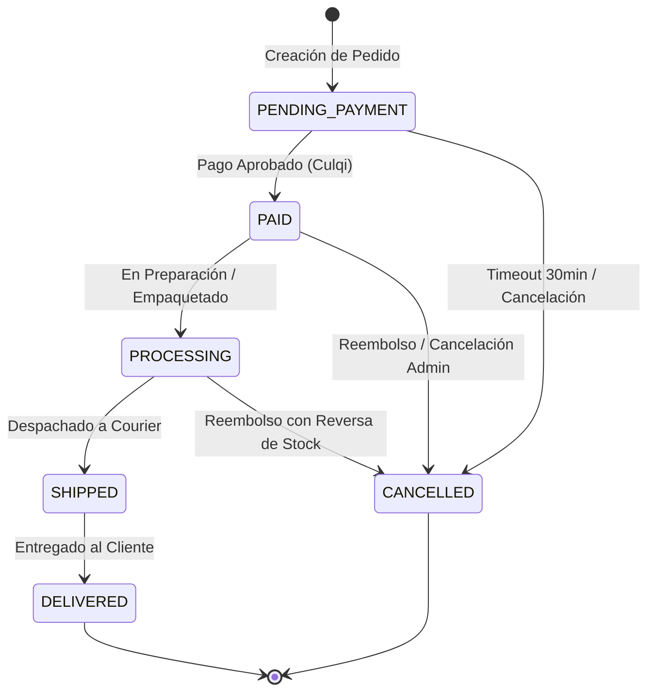

# 🧠 Lógica del Sistema y Arquitectura de Módulos
## Cleo Platform — SaaS E-Commerce Multi-Tenant

> **Documento Maestro de Ingeniería y Lógica de Negocio:** Detalla la arquitectura subyacente, flujos de datos, reglas transaccionales, máquinas de estados y la funcionalidad exhaustiva de cada uno de los 12 módulos del sistema.

---

## 📑 Tabla de Contenidos
1. [Principios de Arquitectura y Diseño](#1-principios-de-arquitectura-y-diseño)
2. [Lógica Transaccional y Reglas Centrales](#2-lógica-transaccional-y-reglas-centrales)
   - [2.1 Aislamiento Multi-Tenant de Cero Fugas](#21-aislamiento-multi-tenant-de-cero-fugas)
   - [2.2 Modelo de Doble Stock y Prevención de Sobreventas](#22-modelo-de-doble-stock-y-prevención-de-sobreventas)
   - [2.3 Integridad Fiscal mediante Snapshots Inmutables](#23-integridad-fiscal-mediante-snapshots-inmutables)
   - [2.4 Máquina de Estados de Pedidos, Pagos y Envíos](#24-máquina-de-estados-de-pedidos-pagos-y-envíos)
   - [2.5 Idempotencia y Procesamiento Asíncrono de Webhooks](#25-idempotencia-y-procesamiento-asíncrono-de-webhooks)
   - [2.6 Tareas Programadas y Cron Jobs](#26-tareas-programadas-y-cron-jobs)
3. [Catálogo Detallado de Módulos del Sistema](#3-catálogo-detallado-de-módulos-del-sistema)
   - [Módulo 1: Auth & Identidad Global (Autenticación y RBAC)](#módulo-1-auth--identidad-global)
   - [Módulo 2: Multi-Tenant Core & Platform SaaS](#módulo-2-multi-tenant-core--platform-saas)
   - [Módulo 3: Catálogo, Atributos y Matriz de Variantes](#módulo-3-catálogo-atributos-y-matriz-de-variantes)
   - [Módulo 4: Inventario en Tiempo Real y Kardex Auditado](#módulo-4-inventario-en-tiempo-real-y-kardex-auditado)
   - [Módulo 5: Carrito Inteligente y Lista de Deseos (Wishlist)](#módulo-5-carrito-inteligente-y-lista-de-deseos)
   - [Módulo 6: Motor Transaccional de Pedidos (Orders Engine)](#módulo-6-motor-transaccional-de-pedidos)
   - [Módulo 7: Pasarela de Pagos, Culqi y Conciliación](#módulo-7-pasarela-de-pagos-culqi-y-conciliación)
   - [Módulo 8: Logística, Zonas Tarifarias y Tracking](#módulo-8-logística-zonas-tarifarias-y-tracking)
   - [Módulo 9: Motor de Cupones y Promociones (Marketing)](#módulo-9-motor-de-cupones-y-promociones)
   - [Módulo 10: Notificaciones Transaccionales Multicanal](#módulo-10-notificaciones-transaccionales-multicanal)
   - [Módulo 11: Auditoría Inmutable y Compliance (AuditLog)](#módulo-11-auditoría-inmutable-y-compliance)
   - [Módulo 12: Facturación SaaS, Planes y Límites de Recursos](#módulo-12-facturación-saas-planes-y-límites-de-recursos)

---

## 1. Principios de Arquitectura y Diseño

Cleo Platform está diseñada bajo una **arquitectura desacoplada en Monorepo** orientada a servicios y dominio (*Domain-Driven Design Lite*):

```
┌─────────────────────────────────────────────────────────────────────────┐
│                           CAPA DE PRESENTACIÓN                          │
│     React 19 + Vite + Tailwind CSS + Lucide Icons + React Query         │
│   ├── Storefront (/): Experiencia de Compra B2C / D2C                   │
│   ├── Tenant Admin (/admin): Panel Operativo de la Tienda               │
│   └── Platform Admin (/platform): Centro de Control SaaS Cross-Tenant   │
└────────────────────────────────────┬────────────────────────────────────┘
                                     │ REST HTTP / JSON + JWT Bearer
                                     ▼
┌─────────────────────────────────────────────────────────────────────────┐
│                              CAPA DE API                                │
│               NestJS 10 + TypeScript + Express + Helmet                 │
│   ├── Interceptors: TransformInterceptor (BigInt), AuditInterceptor     │
│   ├── Filters: HttpExceptionFilter (Mapeo de Errores Unificado)         │
│   ├── Guards: TenantGuard ➔ JwtAuthGuard ➔ RolesGuard                   │
│   └── Pipes: ValidationPipe con class-validator & DTOs                  │
└────────────────────────────────────┬────────────────────────────────────┘
                                     │ Prisma ORM 6 Client
                                     ▼
┌─────────────────────────────────────────────────────────────────────────┐
│                         CAPA DE ALMACENAMIENTO                          │
│               PostgreSQL 16+ (37 Tablas Relacionales)                   │
│   ├── Aislamiento: Filtrado estricto por `tenant_id`                    │
│   ├── Snapshots: JSON inmutable para auditoría fiscal                   │
│   └── Redis 7: Caché de sesiones, rate-limiting y colas                 │
└─────────────────────────────────────────────────────────────────────────┘
```

---

## 2. Lógica Transaccional y Reglas Centrales

### 2.1 Aislamiento Multi-Tenant de Cero Fugas
- **Resolución de Contexto:** El `TenantGuard` extrae la identidad del tenant evaluando en orden:
  1. Cabecera HTTP `x-tenant-slug` (ej: `perucat`).
  2. Subdominio entrante del Host (ej: `tienda.cleoplatform.com`).
  3. Dominio CNAME personalizado (ej: `perucat.pe`).
- **Seguridad en Base de Datos:** Todas las consultas SQL generadas por Prisma inyectan obligatoriamente la cláusula `WHERE tenantId = :resolvedTenantId`. Ninguna tienda puede consultar, alterar ni borrar registros pertenecientes a otra organización.

### 2.2 Modelo de Doble Stock y Prevención de Sobreventas
Para evitar vender unidades que ya están en proceso de pago simultáneo por otros compradores, el inventario se gestiona mediante un modelo de dos cuentas de saldo:

$$\text{Stock Total} = \text{available\_stock} + \text{reserved\_stock}$$

```
                                  [ Cliente inicia Checkout ]
                                               │
                                               ▼
                                   ┌──────────────────────┐
                                   │  ¿availableStock >=? │
                                   └───────────┬──────────┘
                                 SÍ            │            NO
                        ┌──────────────────────┘            └──────────────────────┐
                        ▼                                                          ▼
┌──────────────────────────────────────────────┐                         ┌──────────────────┐
│             RESERVA DE STOCK                 │                         │ Error HTTP 400   │
│ 1. available_stock -= cantidad               │                         │ "Stock agotado"  │
│ 2. reserved_stock  += cantidad               │                         └──────────────────┘
│ 3. Kardex: tipo = 'RESERVATION'              │
└───────────────────────┬──────────────────────┘
                        │
         ┌──────────────┴──────────────┐
  [ Pago Confirmado ]           [ Cancelación / Timeout ]
         ▼                                     ▼
┌──────────────────────────────┐ ┌──────────────────────────────┐
│       VENTA DEFINITIVA       │ │     LIBERACIÓN DE STOCK      │
│ 1. reserved_stock -= cantidad│ │ 1. available_stock += cant   │
│ 2. Kardex: tipo = 'SALE'     │ │ 2. reserved_stock  -= cant   │
│ 3. Stock sale del almacén    │ │ 3. Kardex: tipo = 'RELEASE'  │
└──────────────────────────────┘ └──────────────────────────────┘
```

### 2.3 Integridad Fiscal mediante Snapshots Inmutables
Un error común en e-commerce es relacionar un pedido directamente con la tabla de productos activa. Si el administrador cambia el precio de $S/\ 50$ a $S/\ 80$ o renombra el producto mañana, los pedidos antiguos no deben alterarse.
- **Implementación:** Al crear la orden, la tabla `order_items` almacena copias inmutables de:
  - `product_name`, `product_sku`, `variant_name`, `unit_price`, `subtotal`.
  - `product_snapshot` (campo JSON con fotos, atributos, peso y dimensiones exactas al momento de pagar).
  - `order_shipping_address` almacena una copia estática de la dirección del cliente al momento de la compra.

### 2.4 Máquina de Estados de Pedidos, Pagos y Envíos



### 2.5 Idempotencia y Procesamiento Asíncrono de Webhooks
- Toda transacción de cobro genera una clave de idempotencia única (`idempotency_key`). Si el cliente pulsa el botón "Pagar" dos veces por latencia de red, la pasarela ejecuta un único cobro.
- Los webhooks entrantes de **Culqi** se reciben en `/api/payments/webhooks/culqi`, validando la firma criptográfica. Si la petición ya fue procesada previamente (`event_id` existente), se responde HTTP 200 inmediatamente sin duplicar la lógica de negocio.

### 2.6 Tareas Programadas y Cron Jobs
- **Liberación de Stock Abandonado:** Cada 5 minutos se ejecuta un worker que identifica pedidos en `PENDING_PAYMENT` creados hace más de 30 minutos sin pago exitoso. El worker revierte el stock reservado a disponible (`RELEASE`) y pasa el pedido a `CANCELLED`.
- **Expiración de Cupones:** Diariamente a la medianoche se desactivan cupones cuya `end_date < now()`.

---

## 3. Catálogo Detallado de Módulos del Sistema

---

### Módulo 1: Auth & Identidad Global
- **Propósito:** Gestión de cuentas de usuario, emisión de credenciales de seguridad, inicio de sesión y recuperación de cuentas.
- **Para qué sirve:**
  - Permite a los clientes registrarse en el storefront y a los administradores autenticarse en los paneles de gestión.
  - Genera tokens JWT firmados criptográficamente con tiempo de vida de 7 días.
  - Implementa flujo de recuperación de contraseña en dos pasos (`forgot-password` ➔ generación de token seguro en base de datos ➔ `reset-password` con cambio de hash `bcryptjs`).
  - Protege contra ataques de fuerza bruta mediante `@nestjs/throttler` (Rate Limiting).
- **Tablas asociadas:** `users`, `roles`, `user_tenants`.

---

### Módulo 2: Multi-Tenant Core & Platform SaaS
- **Propósito:** Núcleo de aislamiento de tiendas, resolución contextual de dominios y gestión global del SaaS.
- **Para qué sirve:**
  - Permite la coexistencia de múltiples tiendas independientes (*PeruCat*, *Moda Perú*, etc.) sobre una misma base de datos sin interferencia.
  - Resuelve la marca del tenant mediante subdominios o dominios CNAME personalizados.
  - Provee a los administradores de tienda la capacidad de personalizar sus colores corporativos, tipografía, logotipo, horarios de atención, teléfonos de WhatsApp y correo de soporte.
  - Provee al Super Administrador de la plataforma herramientas para aprovisionar nuevas tiendas en segundos, monitorear métricas de MRR y suspender tenants morosos.
- **Tablas asociadas:** `tenants`, `tenant_settings`, `plans`, `plan_limits`, `subscriptions`.

---

### Módulo 3: Catálogo, Atributos y Matriz de Variantes
- **Propósito:** Modelado y administración de categorías jerárquicas, productos simples y productos configurables con variantes complejas.
- **Para qué sirve:**
  - Permite organizar el catálogo en árboles de categorías y subcategorías (ej. *Arenas Sanitarias ➔ Bentonita*).
  - Gestiona opciones dinámicas de producto (ej. *Peso*, *Talla*, *Color*, *Sabor*) con tipos de visualización en botones o selectores.
  - Genera automáticamente la matriz de variantes (`ProductVariant`), asignando a cada combinación su propio SKU, peso logístico y precio de venta.
  - Administra galerías de imágenes asociadas tanto a nivel de producto general como a variantes específicas.
  - Aplica precios promocionales con fechas de vigencia (`compare_at_price`).
- **Tablas asociadas:** `categories`, `products`, `product_categories`, `product_variants`, `product_options`, `product_option_values`, `product_variant_options`, `product_variant_values`, `product_prices`, `product_images`.

---

### Módulo 4: Inventario en Tiempo Real y Kardex Auditado
- **Propósito:** Control estricto de existencias, reservas preventivas y libro contable de movimientos de almacén.
- **Para qué sirve:**
  - Mantiene el balance exacto de unidades disponibles vs unidades comprometidas en compras en curso.
  - Genera alertas visuales automáticas cuando el stock de un SKU desciende por debajo de su umbral mínimo configurado.
  - Provee una bitácora inmutable (Kardex) que registra la causa exacta de cada alteración de stock (`PURCHASE`, `SALE`, `RESERVATION`, `RELEASE`, `RETURN`, `ADJUSTMENT`, `MERMAS`), indicando el usuario responsable, el stock anterior y el stock posterior.
- **Tablas asociadas:** `inventory`, `inventory_movements`.

---

### Módulo 5: Carrito Inteligente y Lista de Deseos (Wishlist)
- **Propósito:** Gestión de la experiencia de compra previa al checkout tanto para visitantes anónimos como clientes autenticados.
- **Para qué sirve:**
  - Permite a los clientes agregar artículos rápidamente desde cualquier vista mediante un Drawer lateral interactivo.
  - **Sincronización Híbrida:** Mantiene el carrito en `localStorage` mientras el usuario navega como invitado, y lo sincroniza y persiste en la base de datos (`carts`, `cart_items`) inmediatamente tras iniciar sesión.
  - Administra la lista de deseos (`wishlists`, `wishlist_items`) permitiendo guardar productos favoritos y trasladarlos al carrito en un solo clic.
- **Tablas asociadas:** `carts`, `cart_items`, `wishlists`, `wishlist_items`.

---

### Módulo 6: Motor Transaccional de Pedidos (Orders Engine)
- **Propósito:** Orquestación central de la compra, cálculo financiero y registro inmutable de la venta.
- **Para qué sirve:**
  - Ejecuta la creación de la orden bajo transacciones atómicas `$transaction` de PostgreSQL garantizando consistencia absoluta (todo se guarda o todo se revierte).
  - Calcula subtotales, costos de envío por zona, descuentos de cupones e impuestos.
  - Genera números correlativos legibles y únicos de orden (ej: `ORD-2026-0142`).
  - Congela los datos del producto y de la dirección en snapshots inmutables.
  - Registra cada transición de estado en la tabla histórica `order_status_history`.
- **Tablas asociadas:** `orders`, `order_items`, `order_shipping_address`, `order_status_history`.

---

### Módulo 7: Pasarela de Pagos, Culqi y Conciliación
- **Propósito:** Procesamiento de cobros con tarjetas de crédito/débito, validación antifraude y recepción de eventos asíncronos.
- **Para qué sirve:**
  - Integra la pasarela de pagos **Culqi** mediante tokens de tarjeta y pagos seguros.
  - Gestiona los estados del pago (`PENDING`, `PROCESSING`, `PAID`, `FAILED`, `REFUNDED`).
  - Registra la trazabilidad de webhooks en `payment_webhooks` para auditoría y conciliación financiera.
  - Permite al Administrador ejecutar reembolsos controlados revirtiendo el inventario y actualizando los estados correspondientes.
- **Tablas asociadas:** `payments`, `payment_webhooks`.

---

### Módulo 8: Logística, Zonas Tarifarias y Tracking
- **Propósito:** Administración de coberturas geográficas, costos de flete y seguimiento de envíos en tiempo real.
- **Para qué sirve:**
  - Permite configurar zonas de despacho (ej. *Lima Metropolitana*, *Provincias Cercanas*, *Selva / Zonas Extremas*) con tarifas basadas en peso o monto fijo.
  - Al confirmarse el pago, genera automáticamente la orden de despacho en `shipments`.
  - Permite al operador asignar la empresa de transporte (Olva Courier, Shalom, 99Minutos) y el código de remisión/guía.
  - Alimenta la línea de tiempo interactiva post-venta que visualiza el cliente en `/mis-pedidos` mediante eventos registrados en `shipment_tracking`.
- **Tablas asociadas:** `shipping_zones`, `shipping_rates`, `shipments`, `shipment_tracking`, `addresses`.

---

### Módulo 9: Motor de Cupones y Promociones (Marketing)
- **Propósito:** Creación y validación de incentivos comerciales y códigos de descuento.
- **Para qué sirve:**
  - Permite al Tenant Admin crear cupones promocionales con reglas avanzadas:
    - Descuento porcentual (ej. 15% OFF) con tope máximo en soles.
    - Descuento de monto fijo (ej. S/ 20.00 de rebaja).
    - Envío gratis.
    - Monto mínimo de compra en carrito.
    - Límite global de usos y límite por usuario individual.
    - Rango de fechas de vigencia.
  - Valida en tiempo real durante el Checkout la elegibilidad del cupón y registra cada canje en `coupon_redemptions` para evitar reutilizaciones no autorizadas.
- **Tablas asociadas:** `coupons`, `coupon_redemptions`.

---

### Módulo 10: Notificaciones Transaccionales Multicanal
- **Propósito:** Comunicación automatizada por correo electrónico en momentos clave del viaje del usuario.
- **Para qué sirve:**
  - Despacha correos automáticos usando plantillas HTML responsivas con el branding y colores del tenant:
    1. *Email de Bienvenida y Activación de Cuenta*.
    2. *Email de Confirmación de Pedido y Recibo de Pago*.
    3. *Email de Despacho con Courier y Código de Seguimiento*.
    4. *Email de Restablecimiento Seguro de Contraseña*.
  - Registra la bandeja de salida en la tabla `notifications` con estado de envío (`PENDING`, `SENT`, `READ`).
- **Tablas asociadas:** `notifications`.

---

### Módulo 11: Auditoría Inmutable y Compliance (AuditLog)
- **Propósito:** Registro forense y trazabilidad de todas las mutaciones realizadas en la plataforma.
- **Para qué sirve:**
  - Mediante un `AuditInterceptor` global en NestJS, intercepta automáticamente todas las operaciones `CREATE`, `UPDATE` y `DELETE`.
  - Guarda en la tabla `audit_logs`: ID del usuario autor, tenant afectado, entidad modificada, valor anterior (`old_value`), valor nuevo (`new_value`), dirección IP y User-Agent.
  - Permite a los auditores y administradores detectar accesos indebidos, errores operativos o modificaciones sospechosas de precios o configuraciones.
- **Tablas asociadas:** `audit_logs`.

---

### Módulo 12: Facturación SaaS, Planes y Límites de Recursos
- **Propósito:** Modelo de negocio B2B para comercializar la plataforma Cleo como software como servicio (SaaS).
- **Para qué sirve:**
  - Define planes de suscripción (Free, Basic, Pro, Enterprise) con precios y ciclos mensuales o anuales.
  - Establece límites técnicos por plan en `plan_limits` (máximo de productos permitidos, límite de pedidos mensuales, administradores permitidos, almacenamiento de imágenes).
  - Gestiona el estado de suscripción de cada tienda (`ACTIVE`, `TRIAL`, `PAST_DUE`, `CANCELLED`) garantizando el cobro recurrente por el uso de la infraestructura.
- **Tablas asociadas:** `plans`, `plan_limits`, `subscriptions`.
