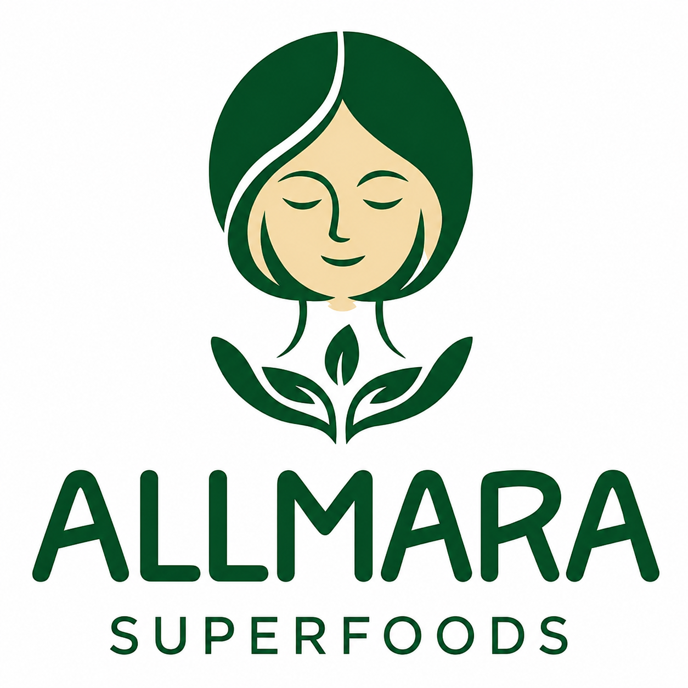
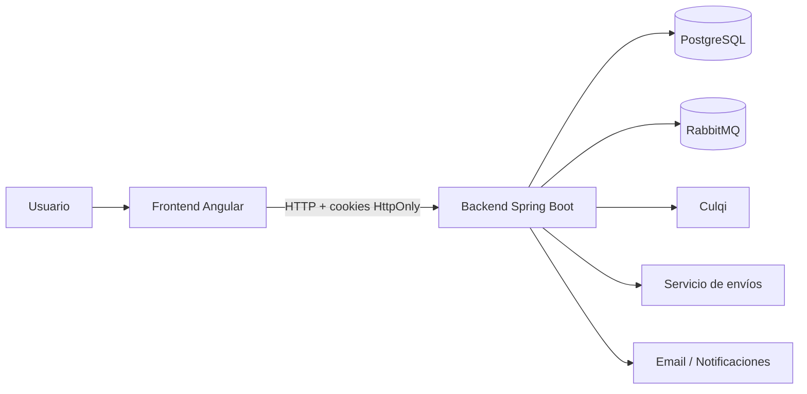
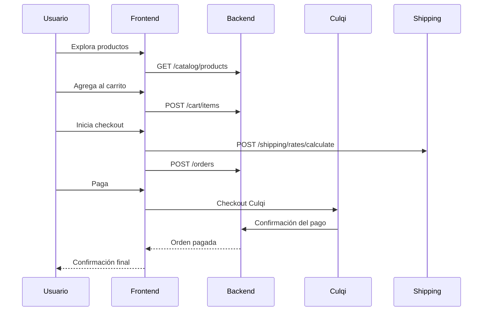
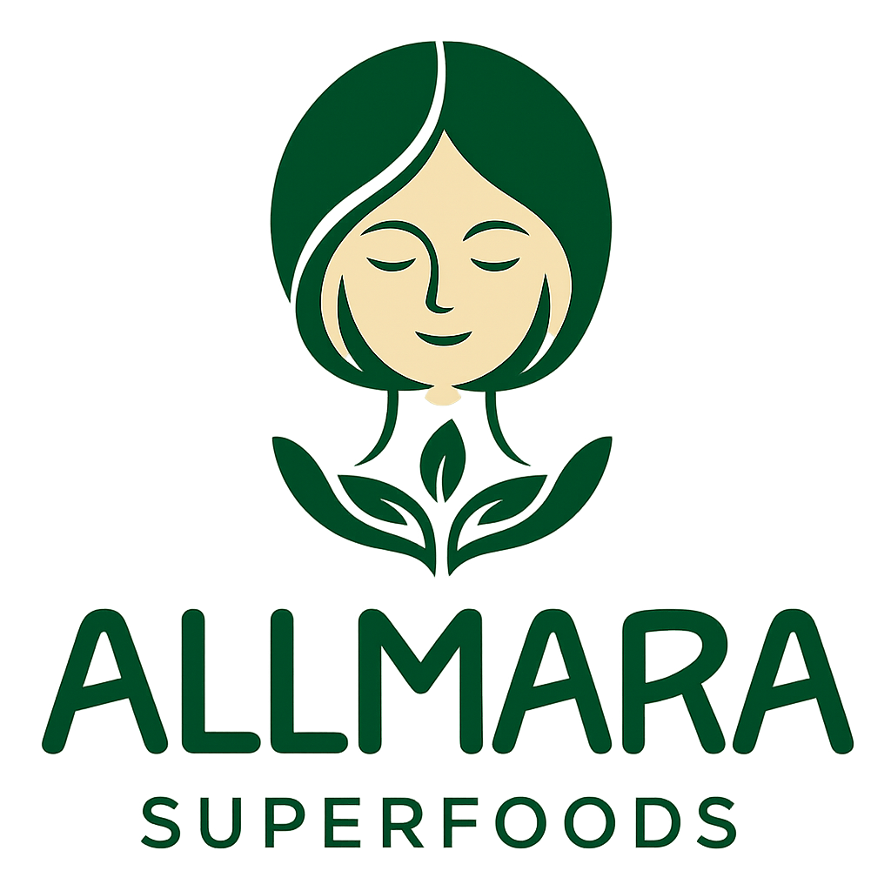
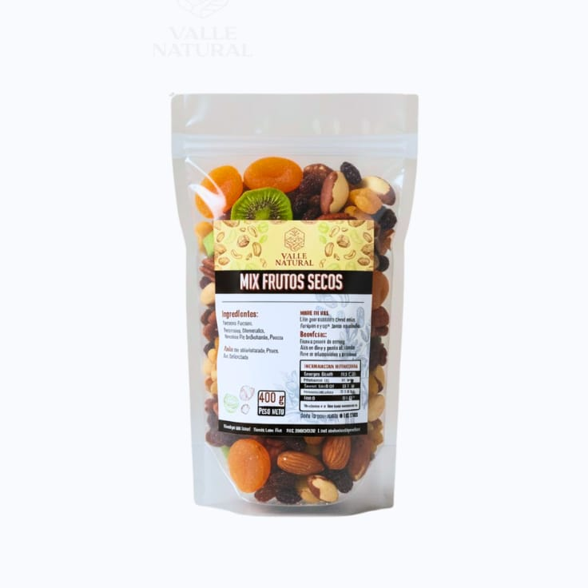
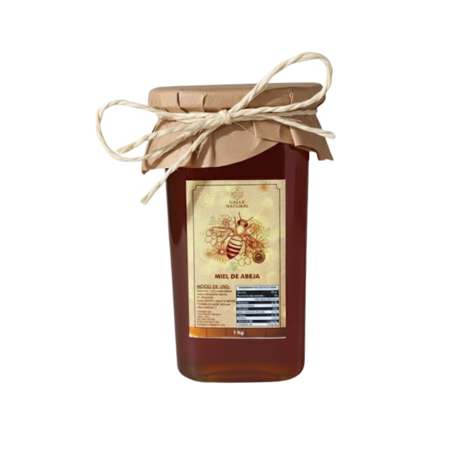
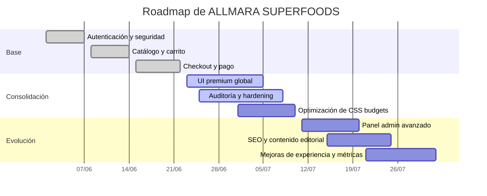

# ALLMARA SUPERFOODS

<p align="center">
  
</p>

<p align="center">
  <strong>Plataforma e-commerce premium para productos naturales, superfoods, frutos secos y bienestar</strong>
</p>

<p align="center">
  
  
  
  
</p>

---

## Vista General

ALLMARA SUPERFOODS es una solución e-commerce orientada a una marca de bienestar natural con experiencia premium.

### Lo que incluye

- Catálogo con productos destacados, categorías y detalle por slug
- Carrito y wishlist con sincronización local y backend
- Checkout con cálculo de envío y flujo de pago con Culqi
- Panel de administración para productos, pedidos, envíos, cupones, usuarios y auditoría
- Autenticación con cookies `HttpOnly`, refresh token y perfil de usuario
- Envíos y tracking, notificaciones por email y mensajería interna

---

## Captura / Identidad Visual

<p align="center">
  
</p>

---

## Arquitectura



### Capas principales

- `valle-natural-app`: frontend Angular
- `ecommerce-backend`: API Spring Boot
- PostgreSQL: persistencia principal
- RabbitMQ: mensajería asíncrona
- Culqi: pagos
- Servicio de envíos: cálculo, tracking y despachos

---

## Flujo Principal



---

## Mapa del Proyecto

```text
E-Commerce/
├── ecommerce-backend/
│   ├── src/main/java/com/ecommerce/
│   │   ├── security/
│   │   ├── catalog/
│   │   ├── cart/
│   │   ├── wishlist/
│   │   ├── order/
│   │   ├── payment/
│   │   ├── shipping/
│   │   ├── coupon/
│   │   ├── notification/
│   │   ├── audit/
│   │   ├── user/
│   │   └── config/
│   └── src/main/resources/
│       └── templates/
└── valle-natural-app/
    └── src/app/
        ├── core/
        ├── shared/
        └── features/
```

---

## Funcionalidades

### Cliente

- Registro, login y recuperación de contraseña
- Exploración de catálogo
- Carrito persistente
- Wishlist
- Checkout con envío
- Pago con Culqi
- Historial y detalle de pedidos

### Administración

- CRUD de productos
- CRUD de categorías
- Actualización de inventario
- Gestión de pedidos
- Despachos y tracking
- Gestión de cupones
- Gestión de usuarios
- Auditoría

---

## Backend

### Módulos

- `security`
- `catalog`
- `cart`
- `wishlist`
- `order`
- `payment`
- `shipping`
- `coupon`
- `notification`
- `audit`
- `user`

### Endpoints clave

```http
POST   /api/v1/auth/login
POST   /api/v1/auth/register
POST   /api/v1/auth/refresh
POST   /api/v1/auth/logout
GET    /api/v1/users/me
GET    /api/v1/catalog/products
GET    /api/v1/catalog/products/{slug}
GET    /api/v1/cart
POST   /api/v1/cart/items
GET    /api/v1/wishlist
GET    /api/v1/orders
POST   /api/v1/orders
POST   /api/v1/payments
POST   /api/v1/shipping/rates/calculate
GET    /api/v1/admin/orders
GET    /api/v1/admin/audit-logs
```

### Seguridad

- Spring Security
- JWT con cookies `HttpOnly`
- refresh token
- roles `CLIENT` y `ADMIN`
- CORS configurado para el frontend

---

## Frontend

### Stack

- Angular 22
- Standalone Components
- Routing lazy-loaded
- Signals
- Interceptor HTTP
- Guards de auth y admin

### Piezas destacadas

- Header premium con carrito, wishlist y perfil
- Footer corporativo
- Pantalla de carga con logo
- Home editorial y visual
- Checkout y pago con Culqi

### Rutas

```text
/                 Home
/productos        Catálogo
/products/:slug   Detalle
/login            Acceso
/register         Registro
/password-reset   Recuperación
/cart             Carrito
/wishlist         Favoritos
/checkout         Checkout
/checkout/payment/:orderId  Pago
/orders           Pedidos
/orders/:orderNumber  Detalle pedido
/admin            Panel admin
```

---

## Diseño

El sitio busca una estética:

- natural
- elegante
- moderna
- limpia
- con sensación premium

### Dirección visual

- Verdes orgánicos
- Acentos dorados suaves
- Tarjetas con vidrio y sombras sutiles
- Microinteracciones suaves
- Layouts aireados y responsivos

---

## Capturas del Proyecto

<p align="center">
  
  
  
  
</p>

---

## Base de Datos

El proyecto se apoya en una base relacional con entidades para:

- usuarios y roles
- productos y categorías
- inventario y precios
- carrito y wishlist
- pedidos y pagos
- envíos y tracking
- cupones
- auditoría
- notificaciones

---

## Desarrollo Local

### Frontend

```bash
cd valle-natural-app
npm install
npm run start
```

### Backend

```bash
cd ecommerce-backend
..\maven\apache-maven-3.9.6\bin\mvn.cmd test
```

> La base de datos debe estar disponible y configurada según `application.yml`.

---

## Calidad y Estado Actual

### Ya implementado

- Autenticación completa
- Catálogo
- Carrito
- Wishlist
- Checkout
- Pagos
- Envíos
- Cupones
- Admin
- Auditoría

### En mejora continua

- Optimización visual de algunas pantallas
- Eliminación de presupuestos CSS excedidos
- Homologación fina de contratos entre frontend y backend

---

## Roadmap



### Próximos frentes

- Reducir los CSS budgets que aún exceden el límite
- Seguir refinando pantallas de admin
- Completar mejoras menores de experiencia y consistencia visual
- Mantener documentación y contratos sincronizados con el backend

---

## Documentación Relacionada

- [contexto.md](./contexto.md)
- [alineacion-backend.md](./alineacion-backend.md)
- [backendEcommerce.md](./backendEcommerce.md)
- [implementacion.md](./implementacion.md)
- [EcommerceBD.md](./EcommerceBD.md)

---

## Marca

ALLMARA SUPERFOODS representa una tienda con foco en bienestar natural, atención cercana y una experiencia de compra visualmente cuidada.

---

<p align="center">
  Hecho con foco en claridad, elegancia y una base sólida para crecer.
</p>
